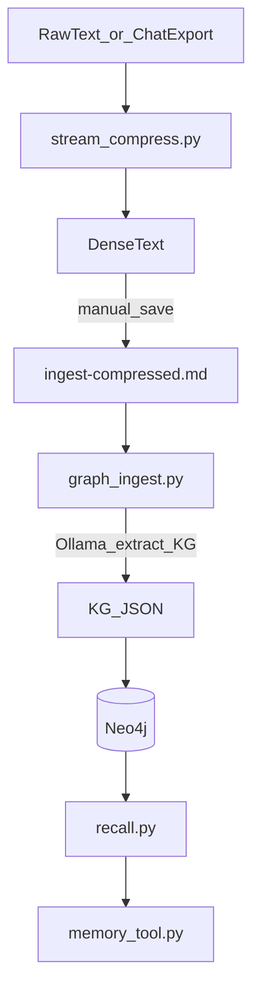

# Shorthand System: Standard Operating Procedure

How to run the semantic compression engine and the optional Neo4j memory pipeline in this repo.

---

## 1. Runnable entrypoints (usage map)

| Script | Input | Output | Notes |
|--------|--------|--------|--------|
| **densify** | Stdin or single string argument | Single compressed line to stdout | Bash script in repo root; calls Ollama `shorthand` via curl. Needs `jq`. Install e.g. to `~/.local/bin`. |
| **stream_compress.py** | Stdin or file list | Dense text blocks to stdout (separator `---`) | Uses Ollama model `shorthand`. Args: `--chunk`, `--overlap`, optional files. |
| **openwebui-chat-compression.py** | Stdin: OpenWebUI export JSON (array of chat objects) | JSONL to stdout (one line per compressed message: `ts`, `role`, `compressed`) | Requires Ollama `shorthand` at localhost:11434. |
| **compress.py** | Stdin or single file path | Single compressed string to stdout | Local Unsloth; needs `lora_shorthand_adapter/` and GPU. |
| **graph_ingest.py** | File: `ingest-compressed.md` (dense text) | Writes to Neo4j (nodes/edges) | Uses Ollama `qwen2.5-coder:latest` to extract KG JSON. Requires `.env` with `NEO4J_PASSWORD`. |
| **recall.py** | One query string (CLI arg) | Prints memory results or `--- NO MEMORY FOUND ---` | Reads Neo4j from `.env` (URI, USER, PASSWORD). |
| **memory_tool.py** | Import and call `query_friday_memory(question)` | String (memory results or error message) | Wraps `recall.py` for use as a tool from other Python code. |
| **check_memory.py** | None | Prints full Neo4j graph to stdout | Same Neo4j `.env` as above. |

**Library:** `shorthand_lib.ShorthandCompressor(model_name="shorthand", ollama_url="http://localhost:11434/api/generate")` — use `.stream_compress(iterator, chunk_size, overlap_size)` or call the internal `_query_ollama(text)` for single blocks.

---

## 2. Quickstart: compression only (Ollama)

1. **Install Python dependencies**
   ```bash
   cd ~/projects/shorthand_llm
   python3 -m venv venv
   source venv/bin/activate
   pip install -r requirements.txt
   ```

2. **Install and run Ollama** (if not already)
   - Install from [ollama.com](https://ollama.com).
   - Ensure the service is running and reachable at `http://localhost:11434`.

3. **Create the `shorthand` model in Ollama**
   - You need a GGUF built from the fine-tuned shorthand model. See [README_compression_engine.md](README_compression_engine.md) for training → merge → quantize → Ollama.
   - From this repo directory:
     ```bash
     ollama create shorthand -f Modelfile
     ```
   - `Modelfile` in this repo expects `./shorthand_q4km.gguf` (or adjust the path). If you only have the base Llama model, you can temporarily use e.g. `llama3.2:latest` and set `ShorthandCompressor(model_name="llama3.2:latest")` — quality will be lower than the dedicated shorthand model.

4. **Run compression**
   ```bash
   # From stdin
   cat my_log.txt | python3 stream_compress.py

   # From files
   python3 stream_compress.py file1.txt file2.txt

   # Optional: smaller chunks, more overlap
   cat big.txt | python3 stream_compress.py --chunk 4000 --overlap 300
   ```

   **Optional: `densify` (single-shot CLI)**  
   The repo includes a small bash script `densify` that compresses one blob of text via Ollama (no Python). Requires `jq` and Ollama with the `shorthand` model.
   - Install so you can run it from anywhere:
     ```bash
     cp densify ~/.local/bin/
     chmod +x ~/.local/bin/densify
     ```
   - Usage:
     ```bash
     echo "The server failed to boot because the kernel panic occurred." | densify
     densify "The server failed to boot because the kernel panic occurred."
     ```
   - Example output: `server -> boot failed & cause:kernel panic`

5. **OpenWebUI chat export → compressed JSONL**
   ```bash
   cat openwebui_export.json | python3 openwebui-chat-compression.py > compressed_chat.jsonl
   ```

---

## 3. Quickstart: memory pipeline (Neo4j)

1. **Compression** (see above). Produce dense text, e.g. by saving `stream_compress.py` output to a file.

2. **Prepare ingest file**
   - Save the dense text into `ingest-compressed.md` in the project root (or symlink/copy it there). This is the only input `graph_ingest.py` reads.

3. **Neo4j and `.env`**
   - Run Neo4j (e.g. Docker: `docker run -e NEO4J_AUTH=neo4j/yourpassword -p 7474:7474 -p 7687:7687 neo4j`).
   - In the project root, create `.env`:
     ```
     NEO4J_URI=bolt://localhost:7687
     NEO4J_USER=neo4j
     NEO4J_PASSWORD=yourpassword
     ```
   - `NEO4J_PASSWORD` is required; `graph_ingest.py` exits with an error if it is missing.

4. **Ingest**
   ```bash
   python3 graph_ingest.py
   ```
   - Requires Ollama with `qwen2.5-coder:latest` (used to extract the knowledge graph from dense text).

5. **Validate and query**
   ```bash
   python3 check_memory.py
   python3 recall.py "Who is Draeician?"
   ```

6. **Use from code**
   ```python
   from memory_tool import query_friday_memory
   print(query_friday_memory("What do I look like?"))
   ```

---

## 4. Operational defaults

| What | Default | Where to change |
|------|--------|------------------|
| Ollama URL | `http://localhost:11434` | `shorthand_lib.ShorthandCompressor(ollama_url=...)`, or env if you add it. |
| Compression model | `shorthand` | `shorthand_lib.ShorthandCompressor(model_name=...)`. |
| Chunk / overlap | 6000 / 500 chars | `stream_compress.py` args: `--chunk`, `--overlap`. |
| Ingest input file | `ingest-compressed.md` | `graph_ingest.py`: `INPUT_FILE`. |
| KG extractor model | `qwen2.5-coder:latest` | `graph_ingest.py`: `MODEL_NAME`. |
| Neo4j | `bolt://localhost:7687`, user `neo4j` | `.env`: `NEO4J_URI`, `NEO4J_USER`, `NEO4J_PASSWORD`. |

---

## 5. Pipeline diagram



---

## 6. Troubleshooting

| Symptom | Likely cause | Fix |
|--------|----------------|-----|
| `Connection refused` or timeout when running `stream_compress.py` / `openwebui-chat-compression.py` | Ollama not running or wrong host/port | Start Ollama; confirm `curl http://localhost:11434/api/tags` works. If Ollama is elsewhere, pass `ollama_url` to `ShorthandCompressor` or change the default in `shorthand_lib.py`. |
| Ollama returns "model not found" or empty response | Model name mismatch | Run `ollama list`. Use a model name that exists (e.g. `shorthand` or `llama3.2:latest`). Set `model_name` in `ShorthandCompressor` or ensure `ollama create shorthand -f Modelfile` was run. |
| `graph_ingest.py` exits with "NEO4J_PASSWORD not found" | Missing or empty `NEO4J_PASSWORD` in `.env` | Create or edit `.env` in the project root with `NEO4J_PASSWORD=yourpassword`. |
| Neo4j "Authentication failed" or "Unable to connect" | Wrong URI, user, or password | Check `NEO4J_URI` (e.g. `bolt://localhost:7687`), `NEO4J_USER`, and `NEO4J_PASSWORD` in `.env`. Ensure Neo4j is running and the bolt port is open. |
| `recall.py` or `check_memory.py` can't connect | Same as above | Same `.env` and Neo4j checks. |
| `graph_ingest.py` crashes on "Error" or JSON parse failure | KG extractor model returned invalid or non-JSON | Ensure `qwen2.5-coder:latest` (or whatever `MODEL_NAME` is) is pulled in Ollama. If the dense text is very long or noisy, try a smaller chunk in `ingest-compressed.md`. Check script stderr for the exact exception. |
| `compress.py` fails on import or "CUDA out of memory" | Unsloth/CUDA env or missing adapter | Use a venv with the same stack as [README_compression_engine.md](README_compression_engine.md) (or README.md CUDA 12.4 flow). Ensure `lora_shorthand_adapter/` exists. For OOM, reduce batch size or use Ollama path instead. |

---

For how the shorthand model was trained and converted to GGUF, see [README_compression_engine.md](README_compression_engine.md).
